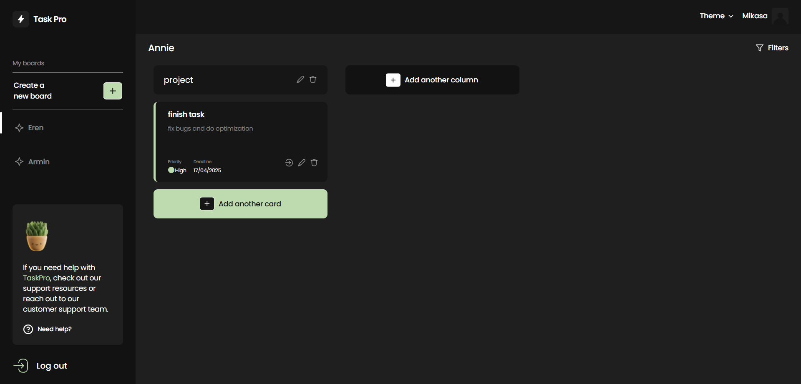

# TaskPro

This is a React-based application for managing tasks and projects, featuring authentication, dynamic boards, task organization, and seamless user experience. It includes role-based access control, customizable themes, and real-time updates for efficient workflow management.

## Features

- 📝 **Task & Project Management** – Create, edit, and delete tasks within dynamic boards and columns.
- 🔒 **User Authentication** – Secure login and registration system with token-based authentication.
- 🎨 **Customizable Themes** – Light, dark, and alternative color modes to enhance user experience.
- 📌 **Drag-and-Drop Functionality** – Easily move tasks between columns for better organization.
- 👥 **Role-Based Access Control** – Manage user permissions for collaborative team environments.
- 🔎 **Search & Filtering** – Quickly find tasks and boards with advanced search options.
- ⏳ **Real-Time Updates** – Experience smooth interactions with instant task status changes.
- 📊 **Pagination Support** – Handle large task lists efficiently without performance loss.
- ❌ **Error Handling & Fallbacks** – Graceful error messages for a seamless experience.
- 🚫 **404 "Not Found" Page** – Clean handling of invalid routes and missing content.

## Tech Stack

- **React & TypeScript** – Core technologies for building a scalable and maintainable UI.
- **Redux Toolkit & Redux Persist** – State management with persistence for seamless user experience.
- **React Hook Form & Yup** – Efficient form handling with schema-based validation.
- **Axios** – API requests with automatic error handling.
- **React Router DOM** – Client-side routing for smooth navigation.
- **Vite** – Fast build tool for optimized performance.
- **ESLint & TypeScript ESLint** – Code quality and linting enforcement.

This stack ensures a **fast, secure, and intuitive** task management application.

## Setup Instructions

To run the project locally, follow the steps below:

### 1. Clone the repository

Clone this repository to your local machine using the following command:

```bash
git clone https://github.com/kolyakr/TaskPro-frontend
```

### 2. Install dependencies

Navigate into the project directory and install the required dependencies:

```bash
cd taskpro-frontend
npm install
```

### 3. Run the development server

Start the development server:

```bash
npm run dev
```

or

```bash
npm start
```

The app will be running at `http://localhost:5173`.

### 4. Build the app

To create a production build of the app, use the following command:

```bash
npm run build
```

This will create a `build` directory with the production version of your app.

## Folder Structure

```bash
TaskPro-frontend/
├── .gitignore            # Git ignored files
├── eslint.config.js      # ESLint configuration
├── index.html            # Main HTML entry point
├── package-lock.json     # Dependency lock file
├── package.json          # Project metadata & dependencies
├── README.md             # Project documentation
├── tsconfig.app.json     # TypeScript app configuration
├── tsconfig.json         # TypeScript global configuration
├── tsconfig.node.json    # TypeScript config for Node.js
├── vercel.json           # Vercel deployment configuration
├── vite.config.ts        # Vite configuration
│
├── public/               # Static assets
│ ├── logo.svg            # App logo
│
├── src/                  # Source code
│ ├── App.module.css      # Global styles
│ ├── App.tsx             # Main App component
│ ├── constants.ts        # Global constants
│ ├── index.css           # Global styles
│ ├── main.tsx            # React app entry point
│ ├── vite-env.d.ts       # Vite environment types
│
│ ├── assets/             # Images & icons
│ │ ├── images/           # Background images
│ │ ├── svg/              # SVG assets
│
│ ├── components/         # Reusable UI components
│ │ ├── Board/            # Task board
│ │ ├── BoardsList/       # List of boards
│ │ ├── CardItem/         # Task card
│ │ ├── CardsList/        # List of task cards
│ │ ├── ColumnItem/       # Task column
│ │ ├── ColumnsList/      # List of task columns
│ │ ├── Dropdown/         # Custom dropdown component
│ │ ├── Filter/           # Task filtering component
│ │ ├── Header/           # App header
│ │ ├── Icon/             # SVG icons handler
│ │ ├── Loader/           # Loading spinner
│ │ ├── LoginForm/        # Login form component
│ │ ├── ModalBoard/       # Modal for creating boards
│ │ ├── ModalCard/        # Modal for task details
│ │ ├── ModalColumn/      # Modal for creating columns
│ │ ├── ModalWindow/      # Generic modal window
│ │ ├── NeedHelp/         # Help section component
│ │ ├── PrivateRoute/     # Route guard for protected pages
│ │ ├── RefreshPage/      # Loader page for refreshing session
│ │ ├── RegisterForm/     # Registration form component
│ │ ├── RestrictedRoute/  # Route guard for public pages
│ │ ├── Sidebar/          # Sidebar navigation
│ │ ├── StartText/        # Placeholder text for empty pages
│ │ ├── UserInfo/         # User profile section
│
│ ├── hooks/              # Custom hooks
│ │ ├── auth.ts           # Authentication-related hooks
│
│ ├── pages/              # Application pages
│ │ ├── AuthPage/         # Authentication page
│ │ ├── HomePage/         # Main homepage
│ │ ├── NotFoundPage/     # 404 Not Found page
│ │ ├── ScreensPage/      # Task screen management page
│ │ ├── WelcomePage/      # Welcome screen
│
│ ├── redux/              # Redux store
│ │ ├── auth/             # Auth slice (actions, reducers, selectors)
│ │ ├── boards/           # Boards slice
│ │ ├── store.ts          # Redux store configuration
│
│ ├── service/            # API services & utilities
│ │ ├── api.ts            # API requests
│ │ ├── boards.ts         # Boards API logic
│ │ ├── cards.ts          #Cards API logic
│ │ ├── columns.ts        # Columns API logic
│ │ ├── formatDate.ts     # Date formatting utility
│ │ ├── localStorage.ts   # Local storage utility
│
│ ├── styles/             # Global stylesheets
│ │ ├── reset.css         # CSS reset styles
│ │ ├── theme.css         # Theme variables
│
│ ├── types/              # TypeScript type definitions
│ │ ├── boards.ts         # Types for boards
│ │ ├── cards.ts          # Types for cards
│ │ ├── columns.ts        # Types for columns
│ │ ├── index.ts          # Global types
```

## Contributing

I welcome contributions to this project! If you'd like to contribute, please follow these steps:

1. Fork the repository.
2. Create a new branch (`git checkout -b feature/your-feature-name`).
3. Commit your changes (`git commit -am 'Add new feature'`).
4. Push to the branch (`git push origin feature/your-feature-name`).
5. Open a pull request.


